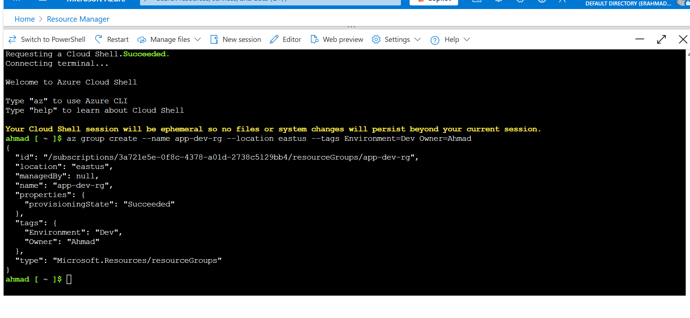
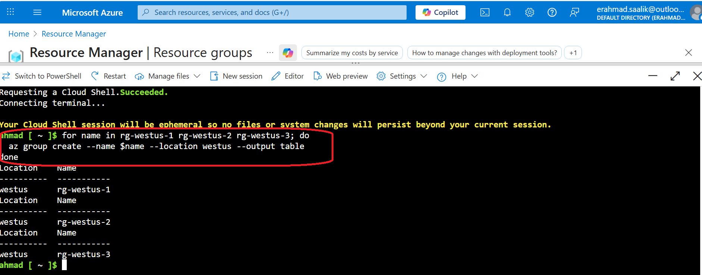
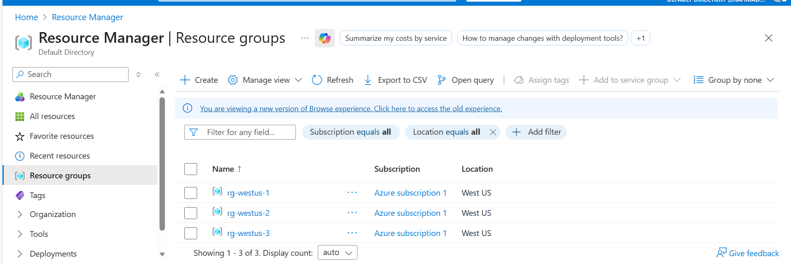
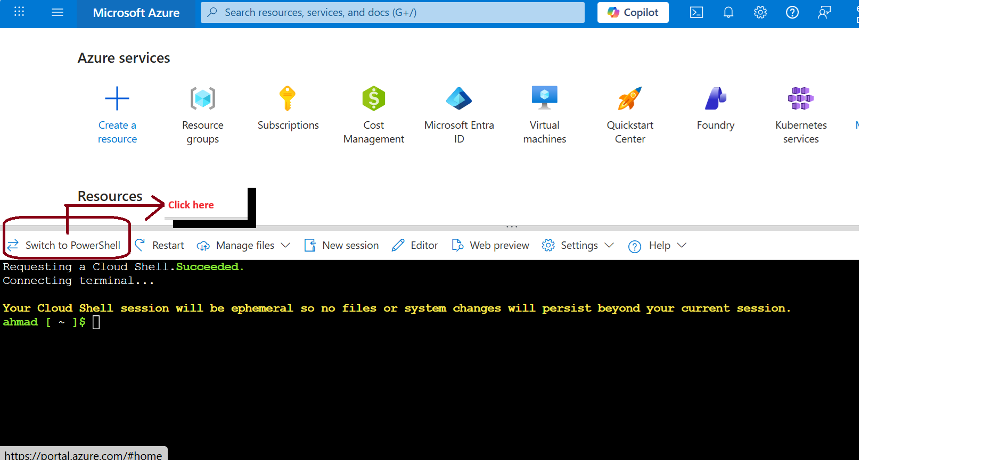
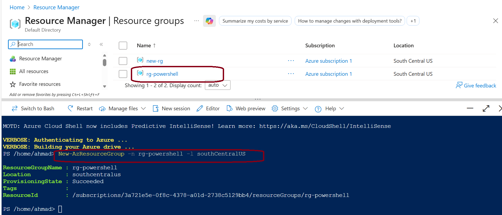
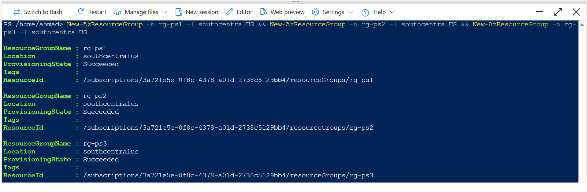
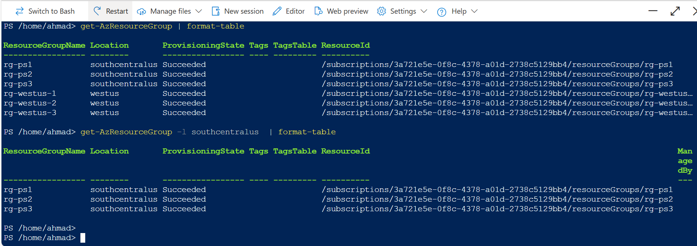

# Lab: Create and Delete Azure Resource Groups

## Objective

Demonstrate end‑to‑end lifecycle management of Azure Resource Groups (create, list, tag, and delete) using the Azure portal and Azure CLI, with focus on governance, cost control, and safe cleanup.  

---

## Concept Overview

- A **resource group (RG)** is a logical container that holds related Azure resources and provides a single scope for deployment, RBAC, policy, and lifecycle operations.  
- RGs are typically aligned to an **application, environment, or workload** (for example, `webapp-dev-rg`, `webapp-uat-rg`) rather than to individual services.   
- Tags on RGs (such as `Environment`, `Owner`, `CostCenter`) are critical for cost allocation and reporting in Cost Management.   

---  

## What I Performed in This Lab  

- Created resource groups in specific regions via portal and CLI:  
  - Portal: *Create resource group* then set name, region, and tags.   
  - CLI: 
```bash
az group create --name app-dev-rg --location eastus --tags Environment=Dev Owner=Ahmad
```

  

The resource group created can be verified from the AZURE portal.


- Listed and verified existing RGs and tags using:   
  - `az group list --query "[].{Name:name, Location:location, Tags:tags}" -o table`.   
- Deleted temporary / lab RGs to clean up costs:    
  - Portal: **Delete resource group** → type RG name to confirm.   
  - CLI: `az group delete --name <resource-group-name> --yes`.  

## Multiple resource group creation --- Automated using bash scripting

```bash
for name in rg-westus-1 rg-westus-2 rg-westus-3; do
  az group create --name $name --location westus --output table
done
```




**Deleting all resource group created above**  
`az group list --query "[?location=='westus'].name" -o tsv | xargs -I {} az group delete --name {} --yes`

---
## Commands to create resource group using POWERSHELL
1. To create a resource group  
```
New-AzResourceGroup -n <resource-group-name> -l <location>
```
For example- 
```
 New-AzResourceGroup -n rg-powershell -l southcentralUS
```
  



2. Creating three resource groups in South Central US Region using the below command:  
`New-AzResourceGroup -n rg-ps1 -l southcentralUS && New-AzResourceGroup -n rg-ps2 -l southcentralUS && New-AzResourceGroup -n rg-ps3 -l southcentralUS`  

 

3. Viewing all the resource groups  
`get-AzResourceGroup | format-table`

4. Filtering resource groups by location
`get-AzResourceGroup -l southcentralus  | format-table`  

 


## Key Learnings

- RG deletion is **asynchronous**: Azure Resource Manager determines dependency order, deletes nested resources first, then parent resources, so the RG can stay in *Deleting* state for some time.  
- A single RG‑level delete permission (`Microsoft.Resources/subscriptions/resourceGroups/delete`) is enough to remove the group and all contained resources, even if the role lacks delete permissions on each resource type individually.  
- Applying **CanNotDelete** locks at RG level protects from accidental RG deletion but can also block automated cleanup (for example, backup restore points and deployment history) if not planned carefully.  

---

## Troubleshooting Deletion Issues

- If RG deletion fails or is stuck, first check and remove **resource locks**:  
  - Portal: **Resource group then click  Locks**.
  - CLI:  
    - List locks: `az lock list --resource-group <rg-name>`.  
    - Delete lock: `az lock delete --ids <lock-id>`. 
- Verify RBAC: ensure the user or service principal has RG delete permission; missing rights appear as authorization errors in activity log or CLI output.   
- If specific resources block deletion (for example, failed deployments, dependent resources, or provider issues), delete or fix those resources individually, then retry RG deletion; persistent issues may require Azure Support.  

---
## Azure CLI vs Azure PowerShell

| **Attribute** | **Azure CLI** | **Azure PowerShell** |
|---|---:|---:|
| **Primary shell / platform** | **Bash/zsh/Cloud Shell** (CLI binary) | **PowerShell Core / Windows PowerShell** (Az module) |
| **Syntax style** | **POSIX-style** commands (az <verb> <noun> --flags) | **PowerShell cmdlets** (Verb-Noun, object pipelines) |
| **Object handling** | **JSON/text** output; parse with `--query` or tools like `jq` | **Rich PowerShell objects** for native pipeline manipulation |
| **Cross-platform support** | **Cross-platform** and Cloud Shell friendly | **Cross-platform** with PowerShell Core; best Windows integration |
| **Best use cases** | **Ad-hoc CLI tasks, CI/CD, shell scripts** | **Complex automation, advanced scripting, Windows environments** |


---
## Pro Insight

Resource groups are logical containers only; their location is metadata for the group itself, not a hard constraint on where contained resources live. VMs, databases, and services can be placed in any region even if the RG is in let say, West US, but doing so creates governance, cost, and performance trade‑offs that should be avoided.

Why to avoid: mixes governance, billing, and recovery boundaries; increases management risk.

Latency: cross‑region UI-DB adds ROUND TRIP TIME, higher commit latency and egress costs.
