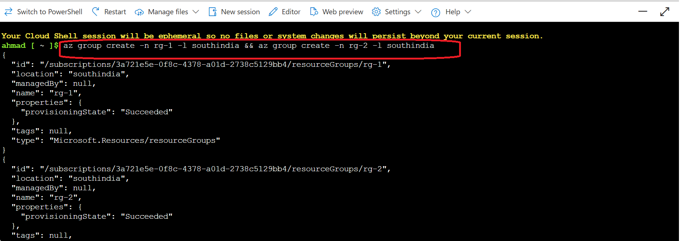
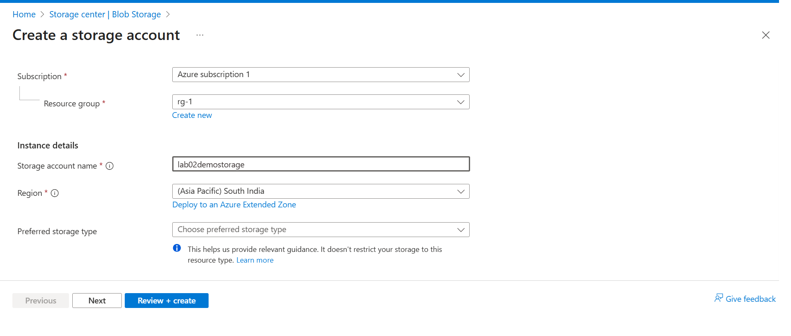
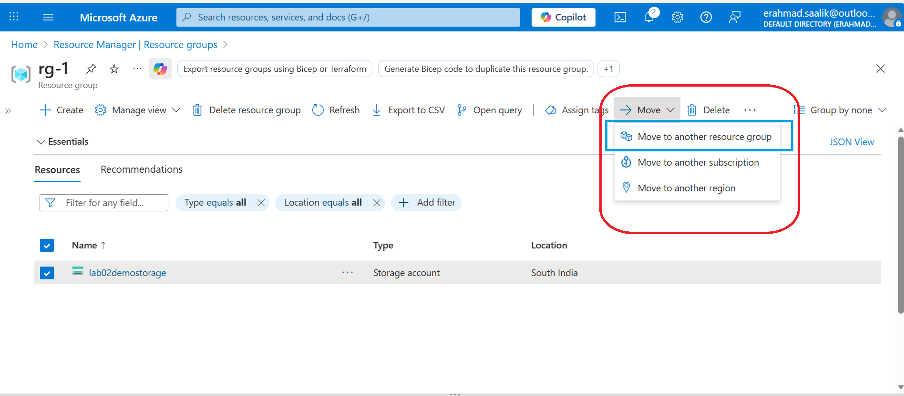
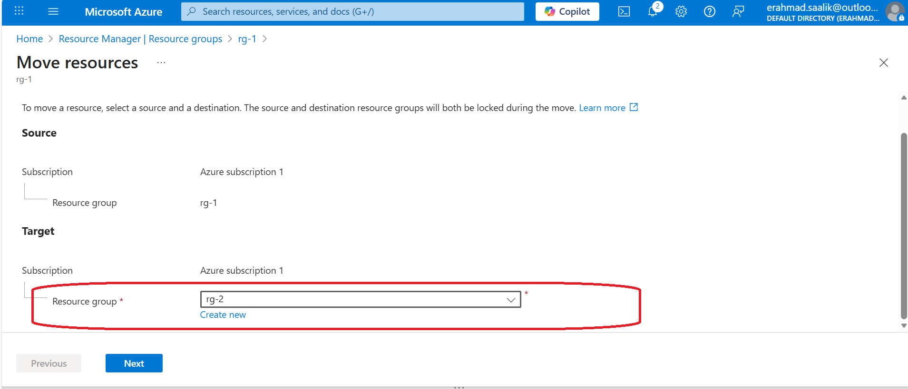
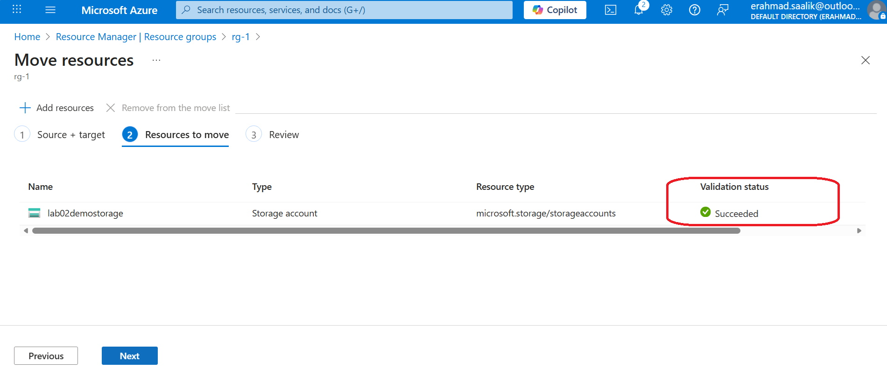
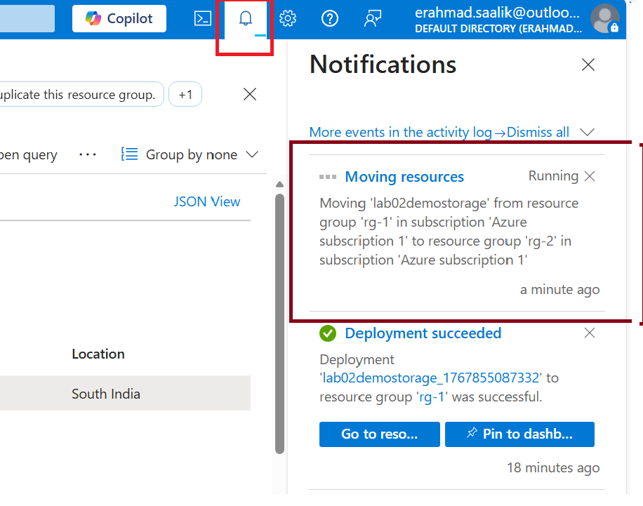
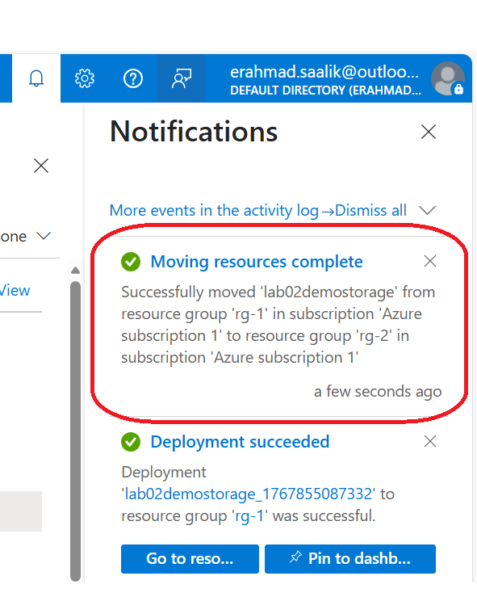
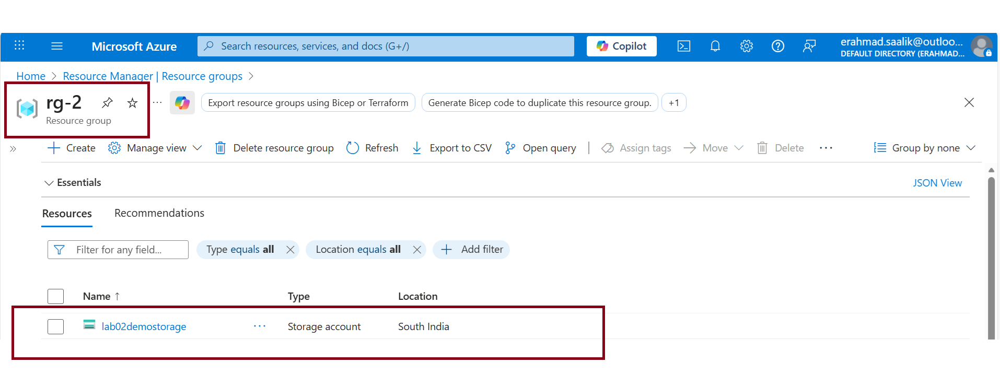

# Lab: Resource Movement Between Resource Groups

## What I Did

Created two resource groups (rg-1 and rg-2) in South India region. Created a storage account under rg-1, then moved it to rg-2 using the Azure portal Move operation.

---

## Why Resource Movement Matters

In real-world scenarios, you reorganize resources as business needs change. Maybe a storage account was created under the wrong project RG, or you're consolidating resources during a migration. Resource movement lets you fix this without recreating everything—tags, settings, and data stay intact.

---

## How I Did It

**Step 1: Created resource groups**
```
rg-1 (South India) ->initial container
rg-2 (South India) ->target container
```
CLI command used:
`az group create -n rg-1 -l southindia && az group create -n rg-2 -l southindia`


**Step 2: Created storage account in rg-1**
- Deployed via Azure portal
- Tagged it with project metadata
- Verified it was working (container, blobs, etc.)




**Step 3: Initiated move operation**
- Portal: rg-1 -> Resource Operations -> Move -> Move to another resource group



- Selected rg-2 as destination



- Azure validated the move was possible


- Checking status of the move operation



- Operation completed in under 5 minutes



**Step 4: Verified move completion**
- Storage account no longer appeared in rg-1
- Appeared in rg-2 with all data intact



---

## Key Learnings

### Resource Groups Don't Move, Resources Do

Here I moved *resources* between RGs. The storage account moved; the RGs stayed in the same subscription. This distinction matters when planning large migrations.

### Physical Location Doesn't Change

Moving a storage account from rg-1 (South India) to rg-2 (also South India) only changes its *logical organization*, not its *physical region*. If you need to move a resource to a different region (like from South India to East US), you use Azure Resource Mover, a different tool. Region migration is more complex due to data locality and compliance.

### RGs Get Locked During Move

This one surprised me. During the move operation, *both* resource groups are locked . You can't create, delete, or modify resources in either RG while the move is happening. This is a safety mechanism to prevent consistency issues.

### Child Resources Move With Parent

If you move a VM, its disks, NICs, and extensions move automatically. You don't move them separately. Only move *top-level resources*—not their dependencies. This is important when scripting moves: if you accidentally try to move a disk (which is a child of a VM), the operation fails with "ResourceNotTopLevel" error

### Not All Resources Can Move

I tested this mentally: VMs can move, storage accounts can move, but some things can't—like resource locks, policy assignments, or Azure AD configurations. Before attempting a move, check the support matrix to know if the resource type is movable. Some resources are permanently tied to their original location for compliance or technical reasons.

### Dependent Resources Might Need Reconfiguration

Moving a resource preserves its internal configuration (for storage: containers, blobs, access keys). But *external* dependencies might break. Example: if a firewall rule references an old NSG location or a networking link is hard-coded, the move might fail or require post-move configuration. In my lab, the storage account had no external dependencies, so the move was clen.

---

## Strategic Implications

### For Infrastructure Teams

Resource movement is how you recover from organizational mistakes without rebuilding. Common scenarios:

1. **Project restructuring:** Teams reorganize; move their resources to reflect new ownership structure.
2. **Migration cleanup:** During a datacenter migration, you consolidate resources into unified RGs for easier management.
3. **Cost allocation fixes:** Realize a resource is tagged under the wrong cost center? Move it to a RG with correct cost tags.


### For Cost Management

Resource movement works with tags and cost allocation. If you move a storage account to a new RG with different cost tags, Cost Management automatically recalculates chargeback. No manual intervention needed. This is critical for multi-department organizations where costs must be accurately allocated.

---

## Constraints I Should Have Known About

### Same Subscription Only (Usually)

In my lab, both RGs were in the same subscription and region, so the move was straightforward. But if I wanted to move across subscriptions, Azure also supports that—though both subscriptions must use the same Azure AD tenant. Cross-subscription moves are more complex because billing changes.

### Validation Before Move

Azure validates before moving. If validation fails (e.g., "resource has a read-only lock," "policy prohibits moving"), the operation is blocked before it starts. This is good—you know immediately if something's wrong, rather than discovering mid-move.

### Move Failures Leave Things Partially Done

If a move times out (after 4 hours), successfully moved resources stay in the destination RG, and failed ones stay in the source. This is half-good, half-bad. You avoid a corrupted state, but you end up with resources split across two locations. The fix: manually move the remaining resources or investigate why some failed.

---

## Practical Mistakes to Avoid

- **Moving resources with locks:** If rg-1 has a "CanNotDelete" lock, the move fails. Remove locks first.
- **Moving shared resources:** If a storage account is used by multiple teams, notify them before moving (RG lock still allows operations on the resource itself, but coordination prevents surprises).
- **Assuming dependencies move:** If a VM depends on a specific VNet that's not being moved, the move fails. Always validate dependency chains first.
- **Moving during business hours:** RG locking during move might affect automation. Schedule large moves during maintenance windows.

---

## Conclusion

 "In my lab, I moved a storage account between resource groups and learned that Azure locks both RGs during the move to maintain consistency. I also realized that moving resources reorganizes *logical* ownership but doesn't change physical location; you use Azure Resource Mover for region migrations. This distinction matters when designing multi-region disaster recovery strategies. Operationally, I saw how resource movement fits cost allocation workflows—moving a resource to a different RG automatically changes its cost center if tags are set correctly at the RG level."


