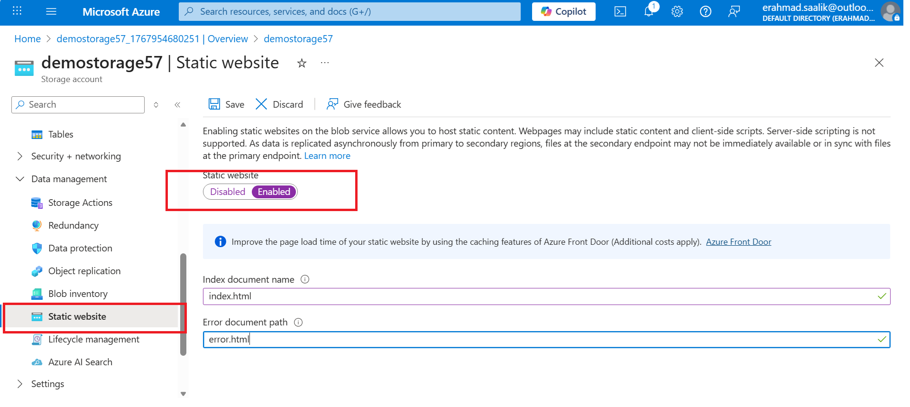
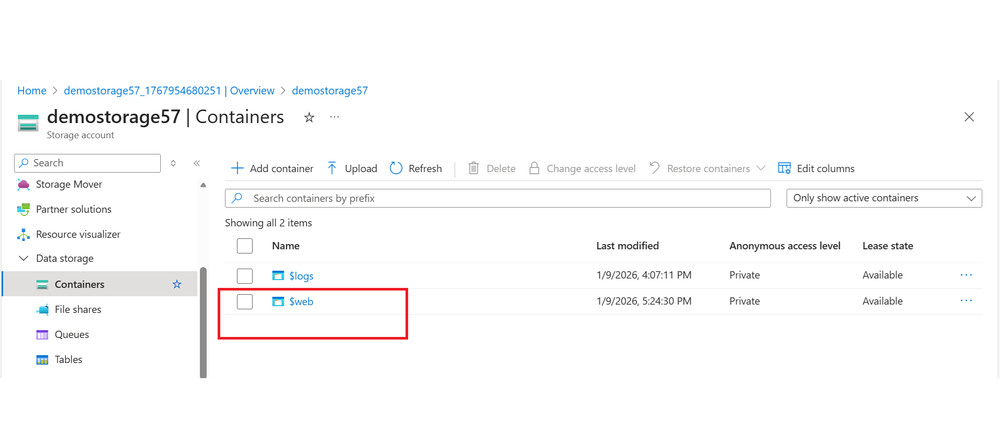
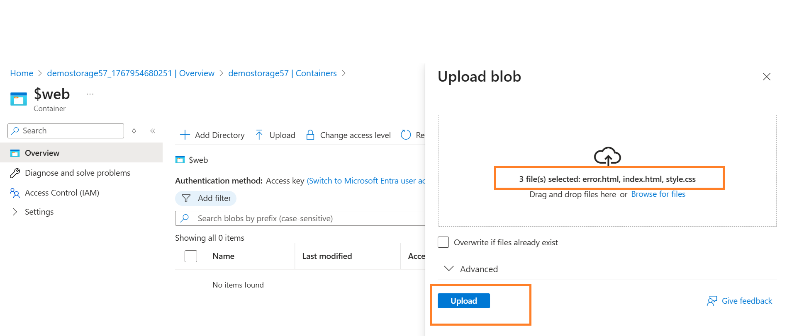
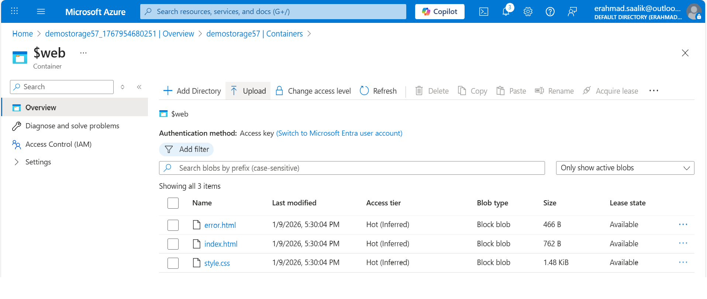
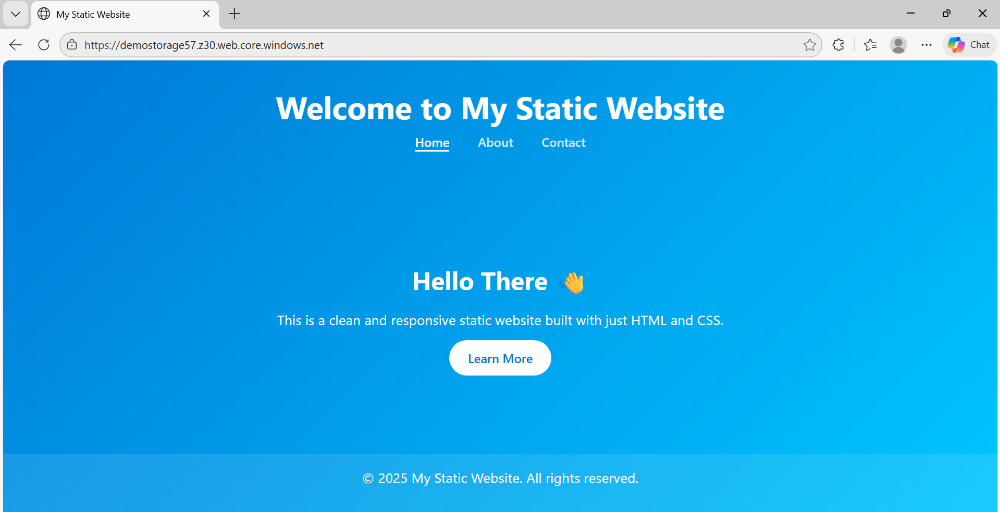
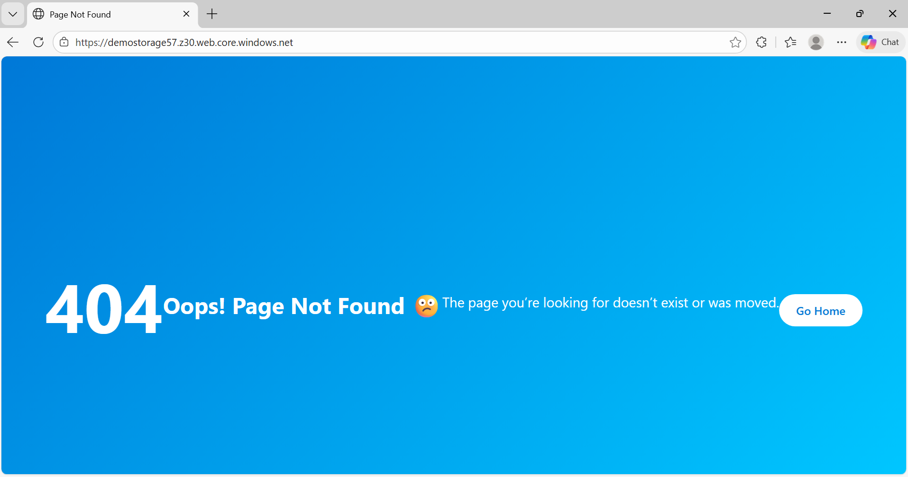

# Lab: Static Website Hosting on Azure Storage

## What I Did  

- Created a storage account and enabled the **Static website** feature.   
- Set `index.html` as the index document and `error.html` as the error document.   

  

##### On clicking Save , we get primary and secondary endpoints. These endpoints will be used as URL to access the website from the browser.    

  

---
- Uploaded both files into the special `$web` container created by Azure.   

    

    

   

---

- Accessed the site using the static website endpoint URL from the storage account.   

 

---
- We also test for the error page by removing index.html from the web container  

 

---

## Why Use Static Website on Storage  

- **No servers to manage:** There is no VM, OS patching, or web server maintenance; Azure Storage simply serves HTML, CSS, JS, and assets.  
- **Cheaper than VMs/App Service:** You pay mainly for storage and outbound bandwidth, often under a few dollars per month for low–medium traffic, instead of a continuously running VM or App Service plan.  
- **High availability by default:** Static content is served from a highly durable storage platform without extra configuration.  

---

## Business Logic

- For simple marketing sites, documentation, or product landing pages , hosting on Azure Storage avoids over‑provisioning full web servers, reduces operational risk, and frees budget for core business workloads instead of basic web hosting.  
---

## Key Observation
- Only one static website can be created in one storage account. So in case we need to host more than one static website, we can create a new storage account.  

