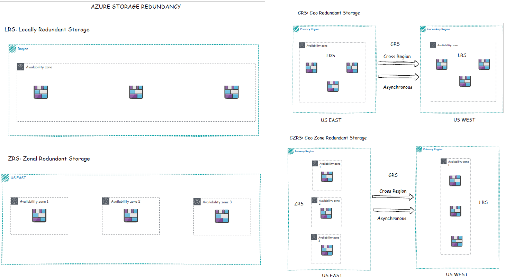
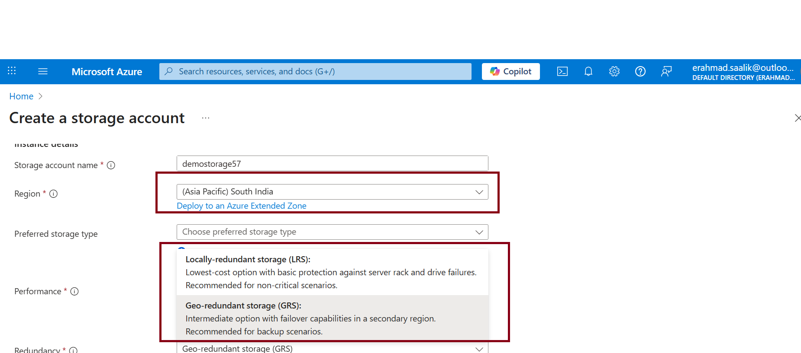
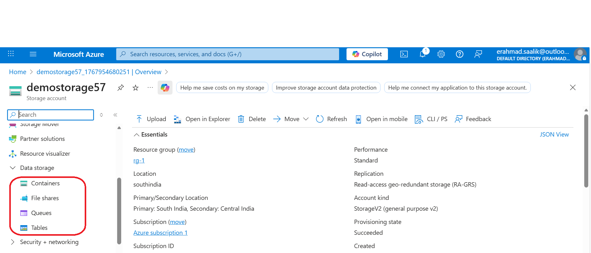
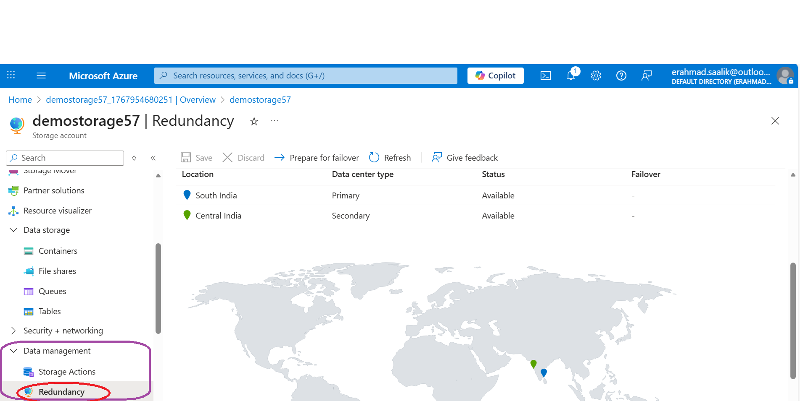

## Hands on Lab Activities:
### 1. Storage Account basics and its type
### 2. Different types of redundancy

**Key pointer:** Inorder to use any storage service in Azure, we need to first create a storage account. This is unlike other cloud service providers where each storage service is individually managed. In Azure , all storage services are centrally managed using Azure Storage Account. 

### Azure Storage Services: Blob storage, File share/File storage, Table storage, Queue Storage

- Blob Storage : object storage
Use case: store unstructured data like images, backups, logs, and media; ideal for large binary objects, static website hosting, and data lakes. Best when you need scalable, cost‑tiered object storage with HTTP(S) access.  

- File Storage : managed SMB/NFS shares  
Use case: provide lift‑and‑shift file shares for legacy apps, home directories, or cross‑platform file sharing (Windows, Linux) using SMB/NFS; good for mounting as network drives and replacing on‑prem SMB shares.  

- Queue Storage :message queuing  
Use case: decouple components with reliable message queues for background processing, job scheduling, and asynchronous workflows; use when you need simple FIFO‑style messaging with high throughput and durability.  

- Table Storage :NoSQL key‑value store   
Use case: store semi‑structured, schema‑less data (telemetry, user metadata, catalogs) with fast lookups by partition/row key; choose Table for low‑cost, massively scalable key‑value workloads when relational features aren’t required  

### Types of Storage account   
### 1. Standard general purpose V2   
- This is the most commonly used storage account   
- Allows creation of  all the four storage services.  
- Supports all four types of redundancy (LRS,ZRS,GRS,GZRS)  
- Cheaper than premium accounts
  
### 2. Premium Block Blobs  
- Supports only blob storage  
- Only ZRS ,LRS replication ( Thus it cant have regional availability)  
- More expensive that standard blob storage  
- Used where high performance is needed with high data transaction rate. e.g. gaming application data

### 3. Premium File share  
- Supports only file storage service
- LRS, ZRS only
- supports both NFS and SMB protocol. (Note : A file storage under standard Gen Purpose V2 supports only SMB protocol)
- Use case: for high performamce , when NFS based protocol is a necessity
  
### 4. Premium page blobs  
- high‑performance page blobs used for Azure managed disks and I/O‑intensive workloads
-  they deliver low latency, high IOPS, and durable random read/write access for VM disks and databases

**Inorder to compare the various storage services ,use the AZURE PRICING CALCULATOR**  
              https://azure.microsoft.com/en-us/pricing/calculator/

## Features of Azure Storage account
- **Security** -Data fully encrypted at 2 levels- at rest and in transit.
- **Scalability** -Need not worry about storage space running out. Scale as per requirement and demand.
- **Accessibility** - Data can be accessed over HTTP/HTTPS across the world. But since data is encrypted , it prevents chance of data leakage. Moreover access to storage services are by default set to private. Data security follows principle of collective responsibility. Both Azure as well as the organisation bear responsibility for data safety and data integrity. 
- **High availability** -Data replicated across multiple data centres (Concept of data redundancy. I will talk about it in the next section.)

## Redundancy
Azure Storage replicates data to protect against hardware failures, outages, and regional disasters; redundancy ensures durability and availability so applications keep running and data is recoverable.  

**Redundancy types**  

- LRS (Locally Redundant Storage): three copies within a single datacenter/region; lowest cost, protects against hardware failure.  
- ZRS (Zone‑Redundant Storage): copies across availability zones in the same region; protects against datacenter/zone failures and offers higher availability.  
- GRS (Geo‑Redundant Storage): replicates to a paired secondary region (async); protects against regional outages but secondary is not read‑accessible by default
- GZRS: Replicates data across availability zones in the primary region and asynchronously to a secondary region, combining zone redundancy with geo‑replication for maximum durability and disaster recovery

**Quick selection guide**
- Use LRS for dev/test or cheap durability.  
- Use ZRS for high availability within a region.  
- Use GRS/GZRS for disaster recovery across regions

## Creating a storage account (Standard General purpose V2)

### Steps: Select subscription, resource group ,region,  Performance: Standard. Also we need to enter a unique name for the storage account which is unique across the entire AZURE platform
### Here I have chosen region as South india .Since South India is a region with single AZ . Thus we have replication option of LRS and GRS only 

Since I created a standard general purpose V2 account, so it provides option to create all the four azure storage services.

Under the navigation panel, under the DATA MANAGEMENT option we can check for the redundancy associated with the account. Since I selected the primary region as South India, so the secondary region is automatically mapped to Central India.

### Key learnings
- ZRS and GZRS replication is allowed only if the primary region is the one with multiple AZs
- In both GRS and GZRS replication , we can only select the primary region. The secondary region is automatically mapped with the primary region and is generally a region closest to the primary region.
- In case of GRS and GZRS ,  the data replication from one region to another is asynchronous i.e. there is latency in data availability.
- Test failover and recovery procedures regularly.  
- Consider data residency and compliance when selecting geo‑replication.  

**COMPLIANCE ISSUE* : In most cases the primary region and secondary region are in same country. However in some case if the country has just one Region , in such case the secondary region may be in another neighbouring country. This can lead to compliance issue if the organisation or the country has a strict data management rule which requires all data to be stored in the country itself.

