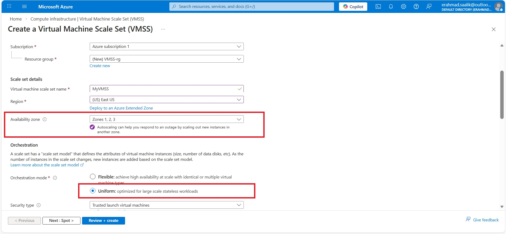

# Lab: Deploying a Virtual Machine Scale Set (VMSS) on Azure

## Overview

In this lab I deployed a Virtual Machine Scale Set (VMSS) using **Uniform orchestration** and configured automatic scaling based on CPU. The goal was to learn how Azure scales stateless workloads horizontally without managing individual VMs.

---
## About VMSS 
Azure Virtual Machine Scale Sets (VMSS) allows to run a group of identical, load-balanced VMs that automatically scale in and out based on demand. They are ideal for stateless application  where traffic is unpredictable, because VMSS improves availability, keeps performance stable under load, and helps control cost by adding capacity only when required and removing it when demand drops

## Steps  Performed

1. Created a new **Virtual Machine Scale Set** in the Azure portal in US East region. Under Avaialability zone I selected all three Zones. This ensures that the VMs launched automataically when demand increases are distributed across all three zones. This ensures high availability.  
  

2. Chose **Uniform orchestration**, selected an Ubuntu image, VM size, and configured admin credentials.  
3. Enabled load balancing and placed the VMSS behind an Azure Load Balancer so instances could share traffic.  
4. Defined the **autoscale policy**:  
   - Minimum instances: **1**  
   - Maximum instances: **5**  
   - Scale out: when average CPU > **75%**, increase instance count by **1**  
   - Scale in: when average CPU < **25%**, decrease instance count by **1**  
5. Deployed the VMSS and verified that instances appeared and were healthy.  
6. Generated load to push CPU above and below thresholds and observed scale‑out and scale‑in behavior.  

---

## Orchestration Modes: Uniform vs Flexible

- **Uniform:** All instances share the same configuration and are managed as a group from a single VM profile. Ideal for web and API tiers where any instance can handle any request. This is the mode I used.  
- **Flexible:** Instances are regular VMs; you can mix sizes and manage each VM individually. Useful when different roles or special configurations are required per VM.

---

## Scaling Modes

- **Manual scaling:** You set a fixed instance count (for example, 3 VMs) and Azure maintains that number. Good for predictable workloads or testing.  
- **Autoscaling:** Azure monitors metrics (CPU, memory proxies, custom metrics) and automatically adjusts capacity based on rules, like the CPU-based policy I configured in this lab.

---

## When to Use VMSS

- **Best for stateless workloads:** front-end web servers, API services, and background workers where no important data is stored on the local VM disk. Any instance can be replaced without affecting user sessions if state is stored in external services (cache, database, storage).  
- **Not suitable for databases and strongly stateful systems:** database engines usually need stable storage and controlled clustering; sudden scale‑in could remove critical nodes. These are better placed on managed database services or carefully managed standalone VMs.  
- **Works alongside load balancers:** VMSS is most effective when combined with a load balancer that spreads traffic and automatically adds or removes instances from rotation as the scale set changes.

---
## Troubleshooting  

**Problem faced** - While creating the VMSS, I was unable to use autoscaling feature. I was prompted to register the service Microsoft.insights.  
**How I resolved the issue** - I opened my Subsription. From the navigation menu on the left I selected Resource provider under settings. then i searched for the service Microsoft.Insights and then registered it.  

## Key Learnings

- VMSS encourages thinking in terms of **capacity and policies**, not individual servers.  
- Uniform orchestration simplifies operations for large, identical, stateless fleets, while Flexible mode is better when per‑VM customization is needed.  
- A well‑designed autoscale policy directly affects **cost, reliability, and user experience**, which is critical for GCC organizations running customer‑facing applications under variable traffic patterns.

