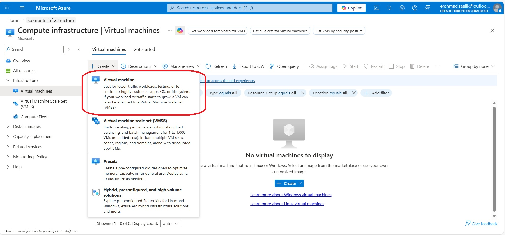
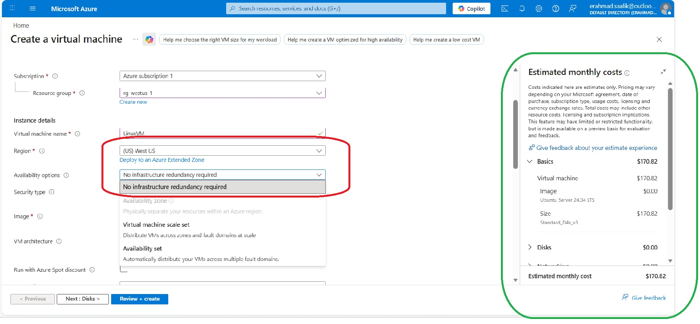
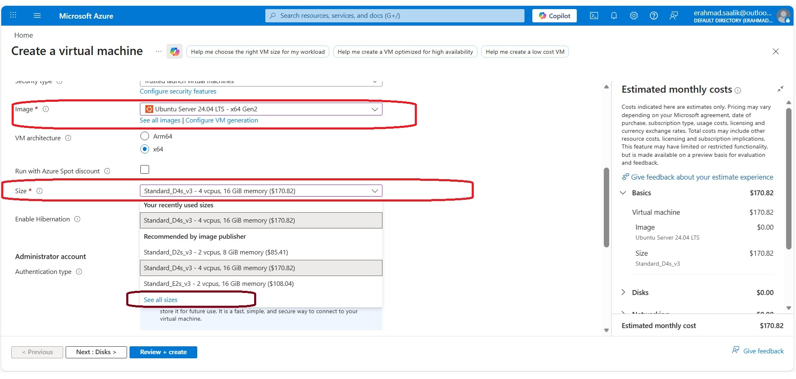
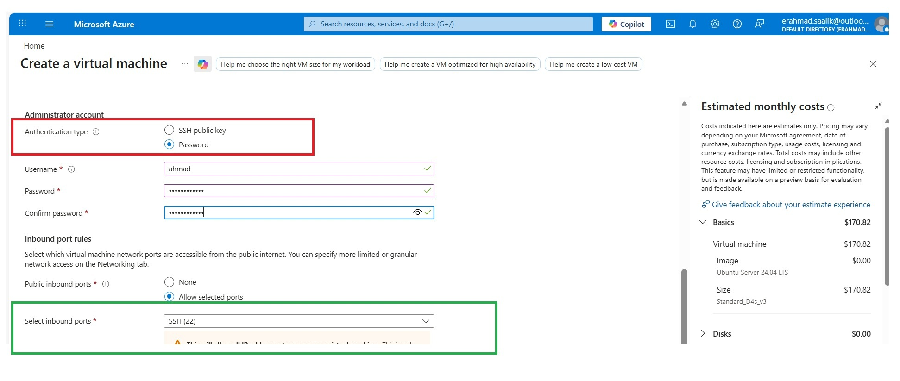
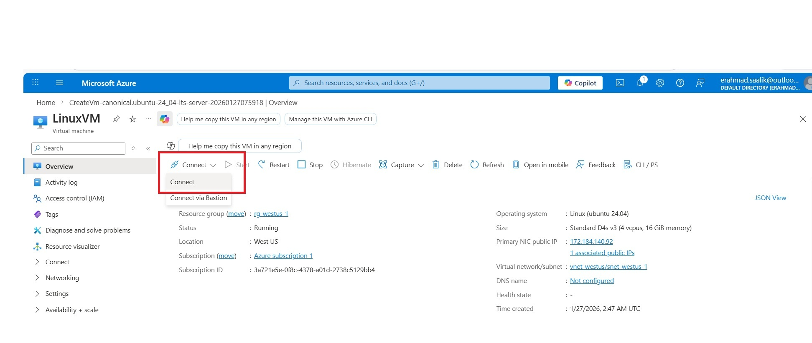
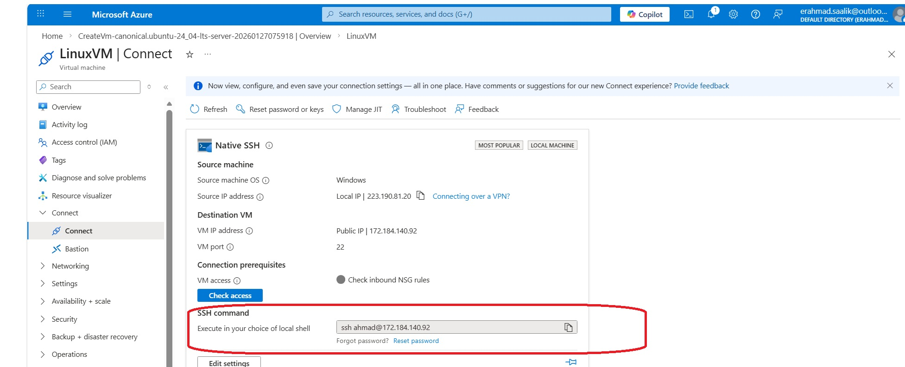
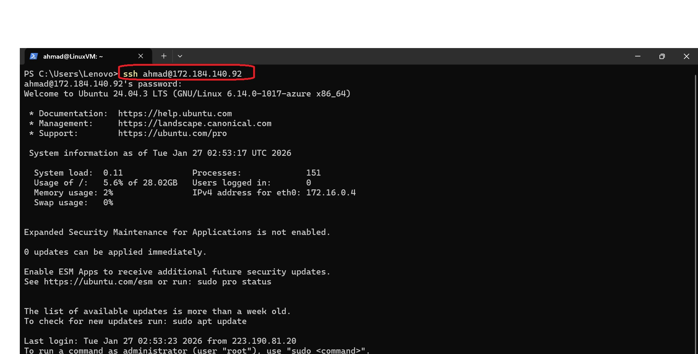

# Lab: Deploying Linux and Windows VMs on Azure

## Overview

This lab demonstrates how I provisioned both Linux and Windows virtual machines on Azure, opened remote access securely, and connected using standard admin tools. It reflects core AZ‑104 skills and practical VM operations relevant for enterprise environments.

---

## Part 1 – Linux VM (Ubuntu)  

**Goal:** Deploy a Linux VM in West US and connect via SSH.  

**What I did**

- Created a new virtual machine in the *West US* region using the Azure portal. Select the Appropriate subscription and Resource Group.  Under Availability Options I selected No infra redundancy required (The option of Availability zone is seen as disabled because West US is a region with Single Availability Zone)  

**Note:On the left part of screen, we can also see the cost associated with the Virtual machine**

- Selected an Ubuntu Server image and an appropriate VM size for lab workloads.  On clicking on 'See all sizes' the various series of CPUs can be accessed and chosen based on the workload  

- Configured admin credentials by selecting authentication type as password and enabled inbound SSH on port 22 .( For sake of simplicity we allowed SSH from anywhere as this VM is just for test purpose. We add tags and then Review and Create.  

- Once the VM is created I clicked on Connect from the Azure portal. From the next window I copied the SSH command which has the user name and the public IP of the Virtual machine.  

- Verified connectivity by connecting from my terminal using the VM’s public IP with `ssh username@public-ip` and then entered the password which I had set while creating the VM.  

**Key learnings**

- Region, image, size, and NSG rules together decide cost, performance, and security.  
- Keeping SSH locked to specific IP ranges is critical in production, especially for regulated GCC customers.

---

## Part 2 – Windows VM

**Goal:** Deploy a Windows Server VM and connect via Remote Desktop.

**What I did**

- Provisioned a Windows Server VM in the same subscription for comparison and mixed‑OS scenarios.  
- Enabled RDP (port 3389) in the NSG and set a strong admin password.  
- Connected from my workstation using Remote Desktop to validate login and basic management.  

**Key learnings**

- Linux (SSH) and Windows (RDP) require different access methods but follow the same Azure VM, networking, and NSG concepts.  
- Choosing the right OS per workload (web, app, legacy line‑of‑business) directly affects licensing cost and operational effort for GCC organizations.

