# Lab: Peering Two VNets and Testing Private Connectivity
**This lab also contains detailed process to create virtual network, adding subnet, configuring NSG and  establishing peering connection. This can be referred by anyone wanting to set up Virtual Networks**

## Table of Contents
- [Prerequisite](#prerequisite)
- [Address Space Examples](#address-space-examples)
- [Network architecture](#network-architecture)
- [Implementation](#implementation)
- [Why This Matters](#why-this-matters)
- [Real production issue that this project can solve](#real-production-issue-that-this-project-can-solve)
- [Real Production Use Case](#real-production-use-case)
- [Key Learnings](#key-learnings)
- [Next Step: Hardening with Azure Bastion](#next-step-hardening-with-azure-bastion)


## Prerequisite

For VNet peering to work, the **address spaces must not overlap**. If two VNets share any part of the same CIDR range, Azure blocks peering because routing becomes ambiguous.

## Address Space Examples

| VNet-A CIDR    | VNet-B CIDR    | Overlap? | Peering Possible? |
|----------------|----------------|----------|-------------------|
| 10.0.0.0/16    | 10.1.0.0/16    | No       | Yes               |
| 10.0.0.0/16    | 10.0.1.0/24    | Yes      | No                |
| 10.10.0.0/20   | 10.20.0.0/20   | No       | Yes               |
| 192.168.0.0/16 | 192.168.0.0/24 | Yes      | No                |

Non-overlapping ranges are essential for clean routing between production, DR, and test networks hosted in different VNets.

---

## Network architecture

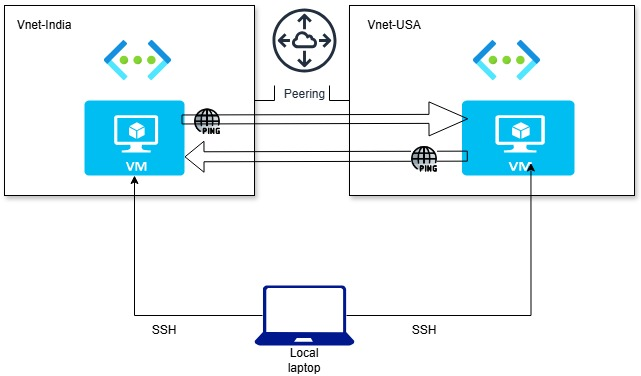  

## Implementation 

- Created **VNet-India** in the *South India* region with two subnets: `subnet1` and `subnet2`.  The detailed steps are shown in below screenshots. The tab/option/row to be clicked or written into has been highlighted 
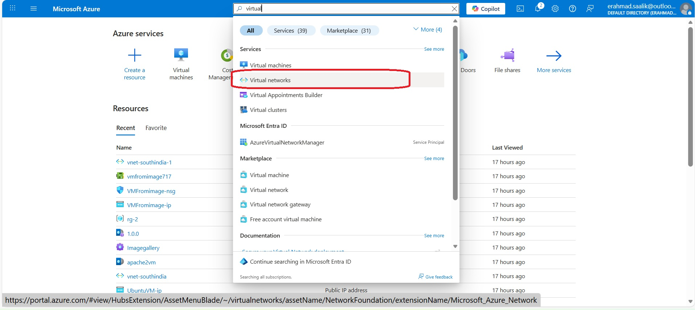
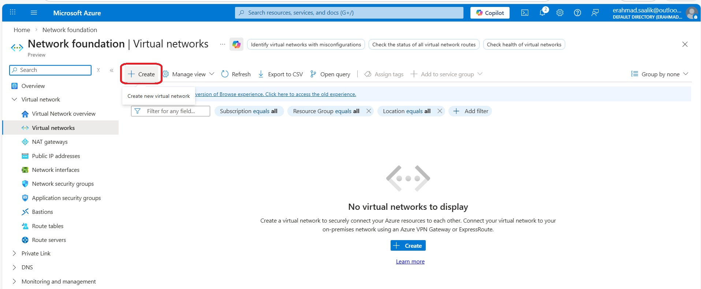
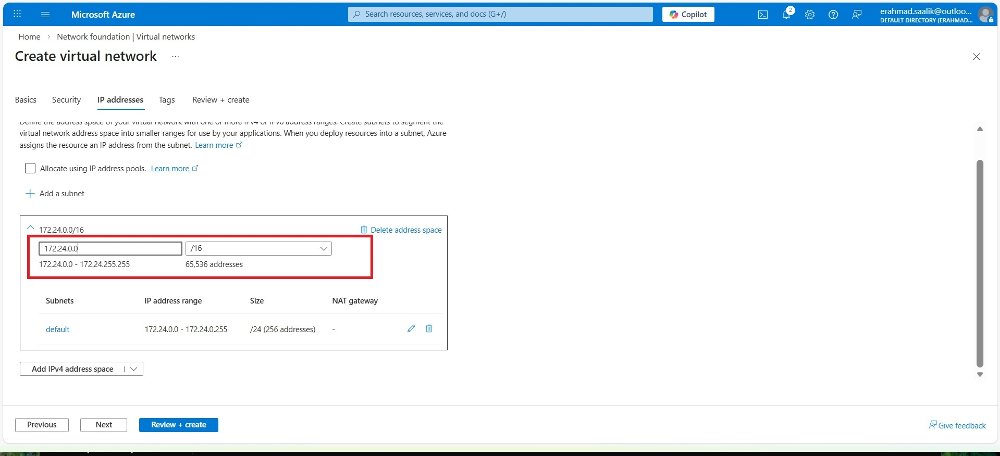
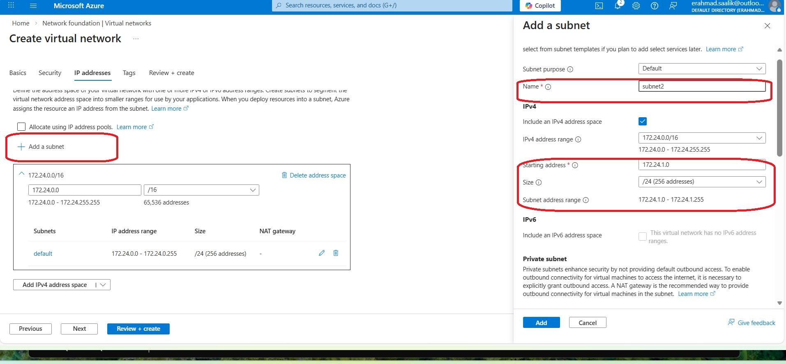

**Azure automatically suggests CIDR for a subnet based on the CIDR of the Virtual network.**  
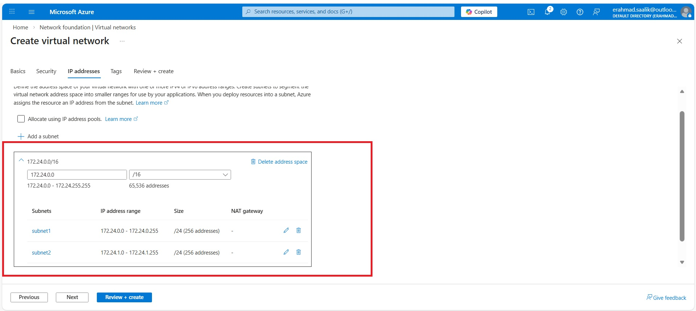

**The Vnet-India is finally created and is available on the portal**
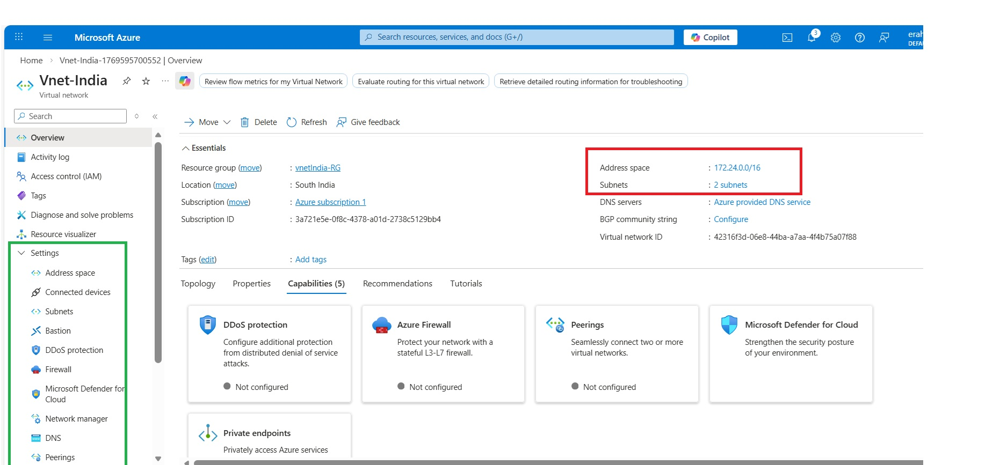


- Created **VNet-USA** in the *West US* region with two subnets: `subnet1` and `subnet2`.  
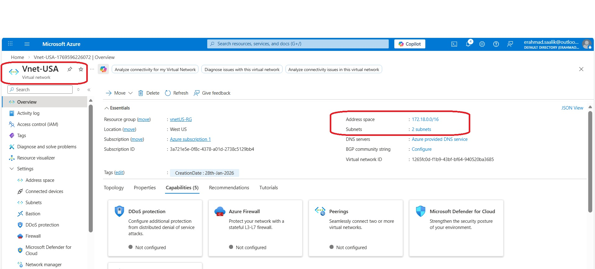

- Both The Virtual networks along with the region they are created in can be seen on the portal.  
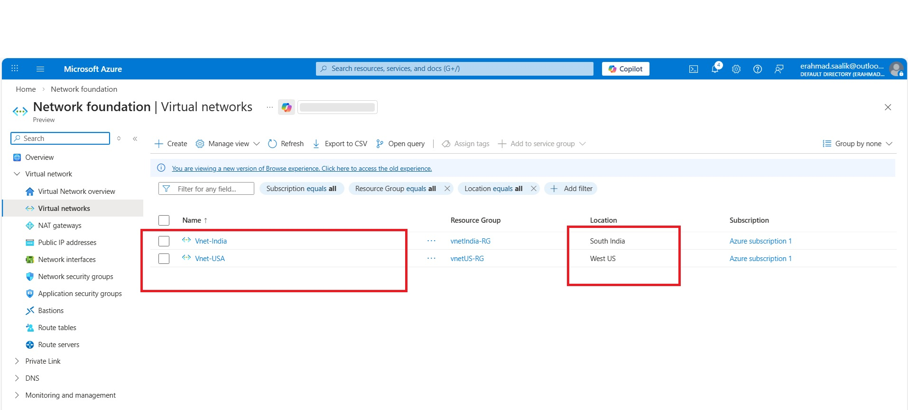

- Deployed **VM-India** into `subnet1` of VNet-India (for this we click on the Networking tab at the top) .I also configured a new NSG and added a rule to allow SSH connectivity on port 22. I also enabled public IP which will be used only for SSH into the VM. 
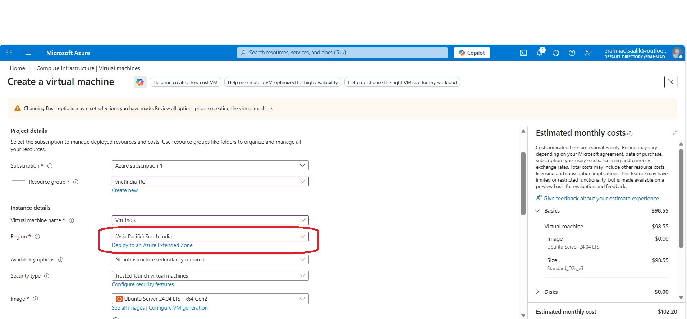

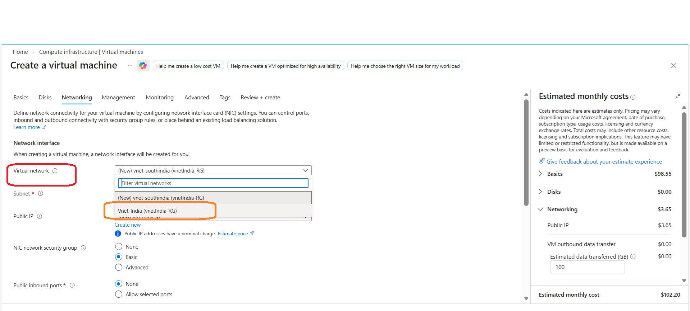
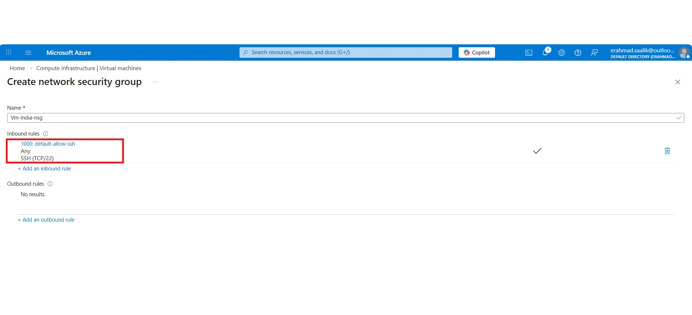

- **Note- This is how the final Networking configuration of the Vm-India looks like**  
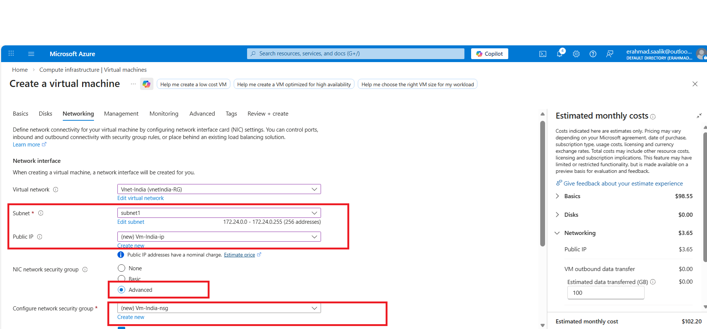

- Finally validate and create . Once validation is passed, I clicked on create and the VM is deployed in Vnet-India. The Public and Private IPs can be seen. These IPs will be used later in the lab.
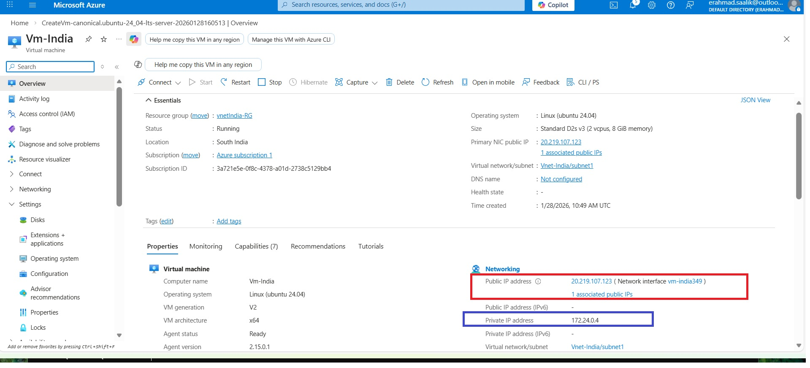

- Similarly another VM is deployed in Vnet-USA Virtual Network which was created earlier in the lab.( inbound SSH on port 22 via NSG is also configured). The public and private IPs of the Vm are taken note of.  


### Configuring Vnet peering
- On the Azure portal select one of the Virtual network out of the two. I selected Vnet-india and then under the navigation panel , I clicked on Settings and then selected Peerings and then clicked on Add as shown below.  
  

- On this page, there are two types of settings. One related to remote virtual network and other related to local virtual network. Remote virtual network settings include target Vnet's peerings and settings. Since I selected Vnet India while adding the peering, so Vnet-USA is the remote network  and Vnet-India is the local network. Accordingly , I configured the settings. 

**Note- Under the remote network settings, select the box to allow Vnet USA to access Vnet india. If this is not done, the peering connection will be unidirectional.Similarly do the same under local network settings**


**Local Virtual Network peering settings**  

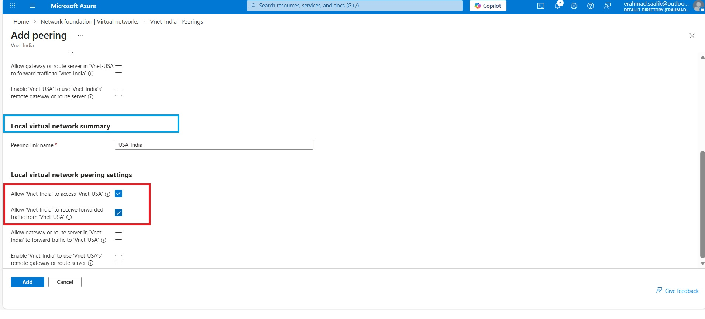

- From the portal , the peering connection can be seen for the two Virtual Networks
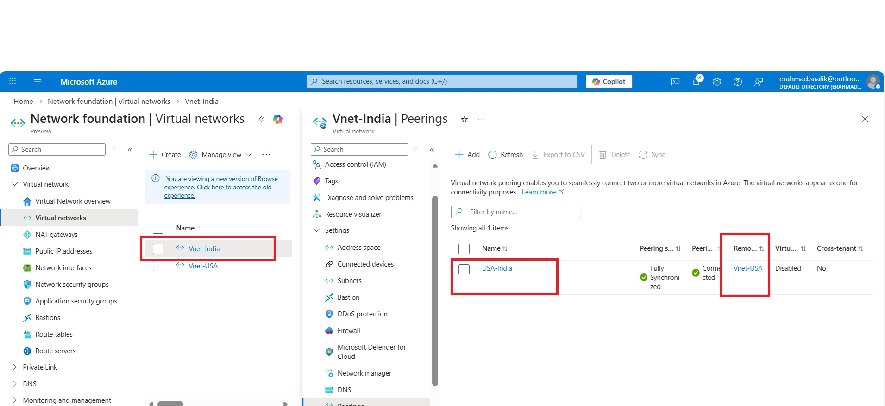  
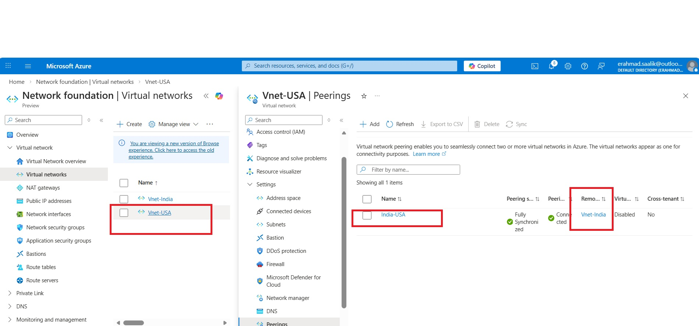  

- Connected to VM-India over SSH from the local terminal using the public IP of the VM.
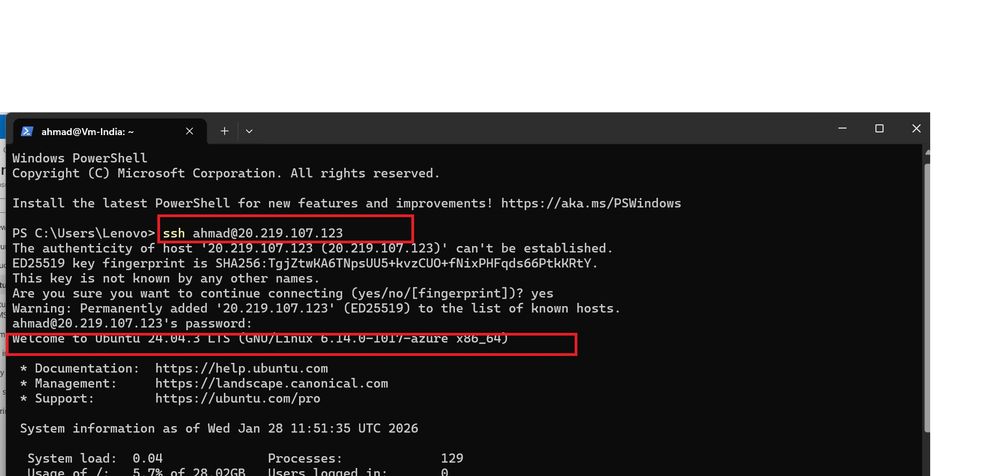  

- Similarly connected to Vm-USA over SSH from the local terminal.  
- Finally successfully **pinged the private IP** of Vm-USA FROM Vm-India to verify private, cross-region connectivity
```
ping -c 5 <private IP of Vm-USA>
```

- Successfully **pinged the private IP** of Vm-India FROM Vm-USA to verify private, cross-region connectivity.
```
ping -c 5 <private IP of Vm-india>
```
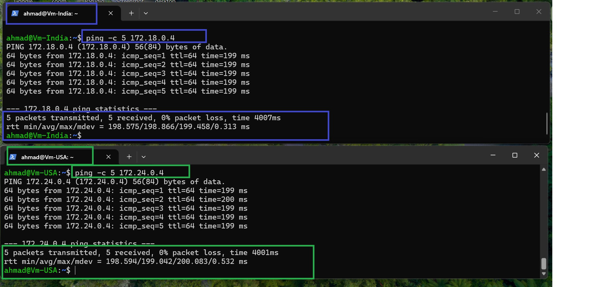

---


---

## Why This Matters 

- **Cross-region architectures:** Peering between South India and West US simulates regional separation often used by  organizations for DR, latency optimization, or global applications serving local users.  
- **Security and compliance:** Traffic stays on Microsoft’s backbone instead of traversing the public internet, supporting strict data-protection requirements common in banking, government, and telecom.  
- **Network segmentation:** Different VNets can represent regulated zones (e.g., core banking vs. customer-facing apps) while still allowing controlled private connectivity.

---

## Real production issue that this project can solve    

This lab’s design solves a classic problem:
**“How do we let workloads in different regions talk to each other privately, without exposing services to the internet or building complex IPsec tunnels for every connection?”**  

By peering VNet‑India and VNet‑USA and keeping communication on private IPs, I am demonstrating the core skill behind:  
- Cross‑region application tiers (web in UAE, APIs or data in Europe/India)  
- Centralized shared services (logging, security tools) reachable from multiple regional VNets  
- DR designs where failover region can reach primary services (and vice versa) for data sync and health checks.  

---

## Real Production Use Case  
In a real production environment, this pattern maps directly to a hub-and-spoke or multi‑region architecture: one region (for example, UAE or Saudi) hosts core workloads, and another region hosts DR, analytics, or local front ends. VNet peering lets these VNets exchange traffic over the Azure backbone with low latency and high bandwidth, without the operational overhead and extra cost of multiple VPN gateways  

## Key Learnings  

- VNet peering makes separate VNets behave like one routed network while keeping **administrative boundaries** such as NSGs and route tables.    
- Overlapping IP ranges are a design-time mistake; planning CIDR blocks up front is critical for multi-region and multi-environment  deployments.  
- Once VNet peering was in place, VM-India could successfully ping Vm-USA over their private IPs without an explicit ICMP rule, because Azure’s default VNet rules already allow ICMP inside and across peered VNets; I only needed to configure SSH in the NSGs for management access.   

---

## Next Step: Hardening with Azure Bastion

In a production design, instead of assigning public IPs to VM-India and VM-USA, I would deploy an **Azure Bastion host** and connect to both VMs over their **private IPs** only. This removes direct SSH exposure to the internet, shrinks the attack surface, and aligns with the zero-trust access patterns expected by security teams in India and GCC countries like  Saudi Arabia, UAE, and Qatar.

