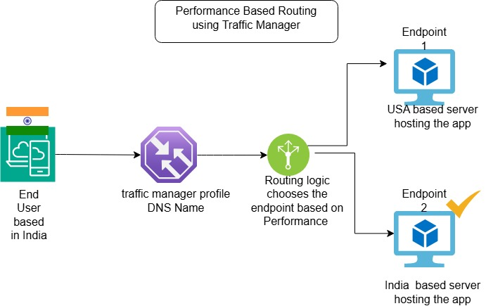
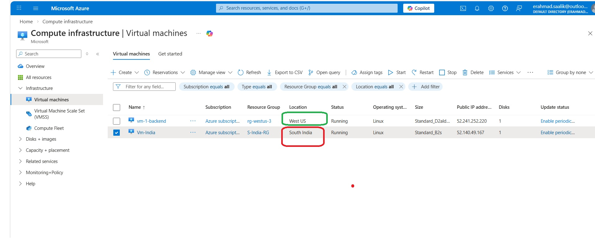
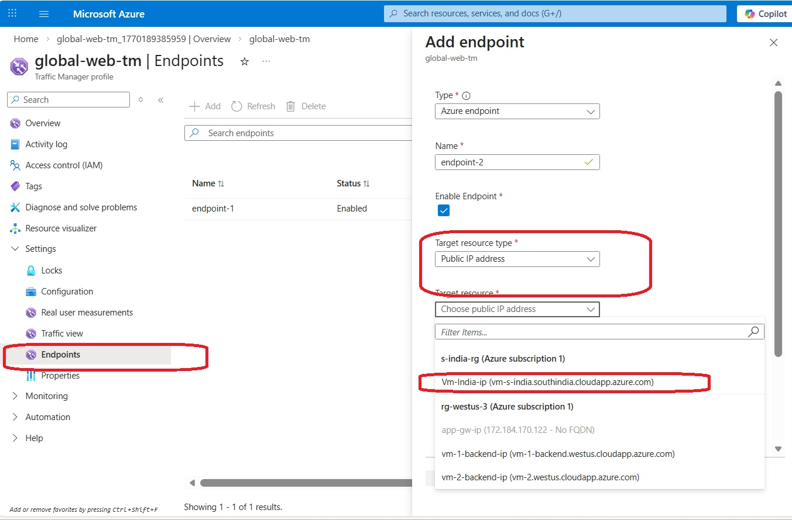
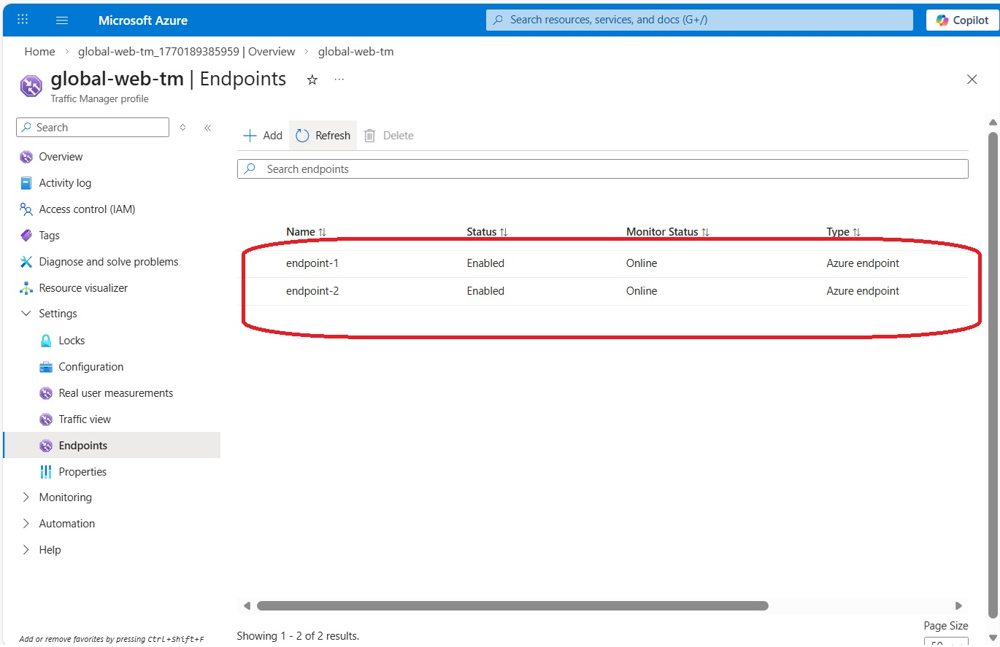
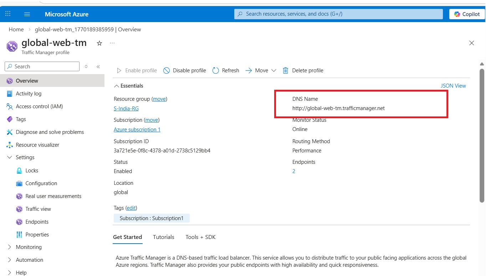
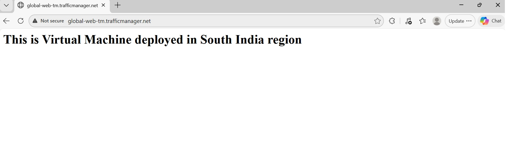

# 🌍 Global High-Availability Web Application
## Azure Traffic Manager Multi-Region Deployment (Performance Routing)

**Author:** Ahmad Saalik Hussain | **DevOps & Cloud Engineer**  
**Date:** February 2026 | **Skills Demonstrated:** Multi-region architecture, Performance-based global routing, Data residency compliance

### 📋 Executive Summary
Deployed globally distributed web app across **West US** and **South India** using **Azure Traffic Manager Performance routing**. Automatically routes users to **lowest-latency endpoint** while respecting regional data boundaries—critical for GCC compliance.

## 🔧 Architecture Overview

- **Routing Method:** Performance (lowest latency wins)
- **Health Probes:** HTTP GET / every 30s
- **Result:** South India selected (45ms from Faridabad)

### 🎯 Traffic Manager Routing Methods

| **Method** | **Crisp Logic** | **GCC Use Case** |
|------------|-----------------|------------------|
| **Performance** ⭐ | Lowest latency | Qatar users → UAE Central (25ms) |
| **Priority** | Primary → Failover | KSA Primary → UAE Backup |
| **Weighted** | Traffic % split | Blue/Green deployments |
| **Geographic** | By country | KSA → Saudi region only |
| **MultiValue** | Multiple healthy IPs | Mobile app server pools |
| **Subnet** | Client IP ranges | Corp VPN → Private endpoints |

###  Implementation Steps
1. **VMs:** Ubuntu based VMs in West US + South India (Public IP + DNS labels)

2. **Apache:** Custom `index.html` on both → HTTP 80 probes
3. **Traffic Manager:** `global-web-tm` Choose performance based routing. Add the public IP of the VMs as endpoints under Traffic Manager profile.

4. Using the traffic profile DNS name and pasting in the browser. Since both the VMs are working perfectly fine and since user is based in New Delhi, so Traffic Manager routes the request to the endpoint based in India(Vm-India based in South India region). This is because it offers lower latency compared to US region. 

💡 Real-World Impact (GCC Data Residency Compliant)  
**1. Static Content (as per the Lab Pattern):** 

Qatar Shopping App → UAE Central Server (25ms)
-  Loads: Product images, CSS, JavaScript ✓
-  Customer data stays in Qatar database (Compliant)
-  Result: Fast pages + local data storage  
**2. Enterprise Dashboards:**  
Saudi Logistics → UAE Central (Backup)  
-  Shows: Truck locations, delivery times (No personal data)  
-  Customer info stays in Saudi database ✓  
**3. Banking (Strict Rules):**  

KSA Bank Users → Saudi Servers ONLY  
-  Geographic routing blocks cross-border traffic  
-  100% PDPL compliant  

### ⚖️ Traffic Manager vs. Load Balancer: The Critical Gap
| Feature              | Azure Load Balancer          | Azure Traffic Manager              |
|----------------------|------------------------------|------------------------------------|
| **Scope**            | Single region (L4 TCP/UDP)  | Global, cross-region (DNS-based)  |
| **Use Case**         | VM Scale Sets in one AZ     | Multi-region DR/performance       |
| **Failover**         | Intra-region health probes  | Global failover (30s TTL)         |
| **Why LB Fails Here**| Can't route across regions | Fills gap with DNS intelligence   |

**Load Balancer** works within one region (e.g., West US only). For **cross-region** like US-India, Traffic Manager's DNS layer resolves the right IP based on user location/health—essential for true global HA.  

### 🏆 Business Value  
- **Cost-Efficient HA:** Pay only for healthy regions.  
- **Scales to Multi-Cloud:** Add non-Azure endpoints.  
- **GCC-Ready:** Supports sovereign clouds, low-latency routing for Middle East users.  

**🔗 Demo:** `global-web-tm.trafficmanager.net` | 
